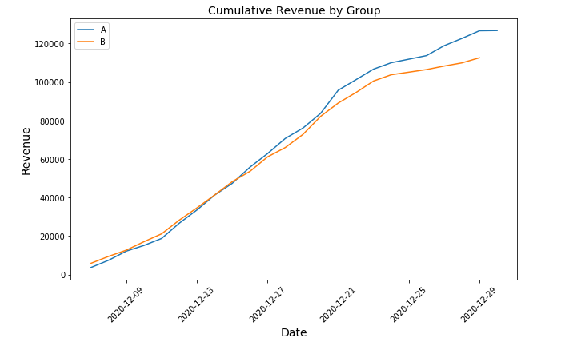

# Customer Churn Prediction

   
 

## [Detailed Project Link](https://nbviewer.org/github/Emmanuel-Nti/customer_churn_prediction_and_retention_strategy/blob/master/customer_churn_nti.ipynb)

## How I Approached the Project
- Importation of the data and Libraries
- Preprocessed the data and carried out exploratory data analysis 
- Evaluated the A/B test results
  - Selected the participants for the test
  - Formulated and tested statistical hypotheses about the test results
- Conclusion and Recommendations
 
## Customer Journey

   
 

 
## Revenue From Each Group  
 

   
 

 
## General Findings
- The EU participants dominate all other regions in the sample.
- The maximum order total in USD for purchase events is about 500, and the min is about 5 dollars, with a mean of about 23.88 dollars and a standard deviation of about 72.22.
- About 66% of users proceed from login to the product page; about 50% of those at the product page proceed to purchase.
- About 15% of customers proceed to purchase without putting the product in the cart.
- About 33.33% of users convert.
- In the initial test by my predecessor, 441 users belonged in both groups, and 446 users participated in both tests.
- The highest number of events occured on the 21st December, 2020 (14044 events).
- 8961 participants; representing about 23% of the new users on or before 21st December 2020, from the EU region were used for the test.
- There is statistically significant difference between groups A and B which implies the test was successful.

## Recommendations
- Stop the test, there is significant difference between the groups. However, group A significantly exceeds group B in number of customers and revenue. 
- Thus, there will be reduction in purchase with the introduction of the improved recommendation system; do not introduce the recommendation system.

## Libraries Used
- Pandas 
- Numpy 
- matplotlib
- Plotly 
- Seaborn
- Scipy  
